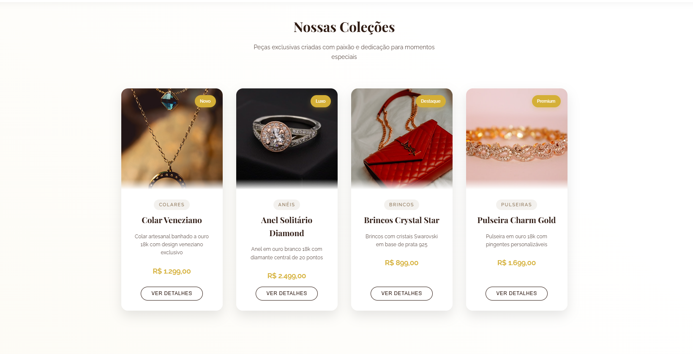

# Elegance Jewelry - Institutional Website



## 📝 About The Project

Elegance Jewelry is a modern and elegant institutional website developed with HTML, CSS, and JavaScript. The site features a sophisticated and responsive interface, perfect for showcasing our exclusive jewelry collections.

## 👨‍💻 Developer

[](https://github.com/trydavidqix)
[](https://linkedin.com/in/trydavidmacedo)
[](https://instagram.com/davidqix)

## ✨ Featured Collections

- **Venetian Necklace** - Handcrafted 18k gold-plated necklace with exclusive Venetian design
- **Diamond Solitaire Ring** - 18k white gold ring with 20-point center diamond
- **Crystal Star Earrings** - Earrings with Swarovski crystals on 925 silver base
- **Charm Gold Bracelet** - 18k gold bracelet with customizable charms

## 🛠 Technologies Used


## 🎨 Color Palette

- Primary: `#2c1810` (Dark Brown)
- Secondary: `#d4af37` (Gold)
- Text: `#2c1810`
- Background: `#faf7f2`
- Accent: `#8b7355`

## 🚀 How to Run The Project

1. Clone the repository:
```bash
git clone https://github.com/trydavidqix/elegance-jewelry.git
```

2. Install dependencies:
```bash
npm install
```

3. Run development server:
```bash
npm run dev
```

4. For production build:
```bash
npm run build
```

## 📱 Responsiveness

The website is fully responsive and adapts to the following breakpoints:

- Desktop: > 1024px
- Tablet: 768px - 1024px
- Mobile: < 768px
- Small Mobile: < 480px

## 📂 Project Structure

```
/
├── assets/
│   ├── img/
│   ├── style/
│   └── script/
├── index.html
├── package.json
└── vite.config.js
```

## 💎 Product Categories

- NECKLACES - Exclusive pieces with unique designs
- RINGS - Solitaires and 18k gold wedding bands
- EARRINGS - Collection with crystals and precious stones
- BRACELETS - Customizable designs in gold and silver

## 📞 Contact

- **Address**: Av. Paulista, 1000 - São Paulo - SP
- **Hours**: Monday to Saturday, 10 AM to 7 PM
- **Email**: contact@elegancejewelry.com
- **Phone**: +55 (11) 99999-9999

---
Developed with ❤️ by [David William](https://github.com/trydavidqix) 

